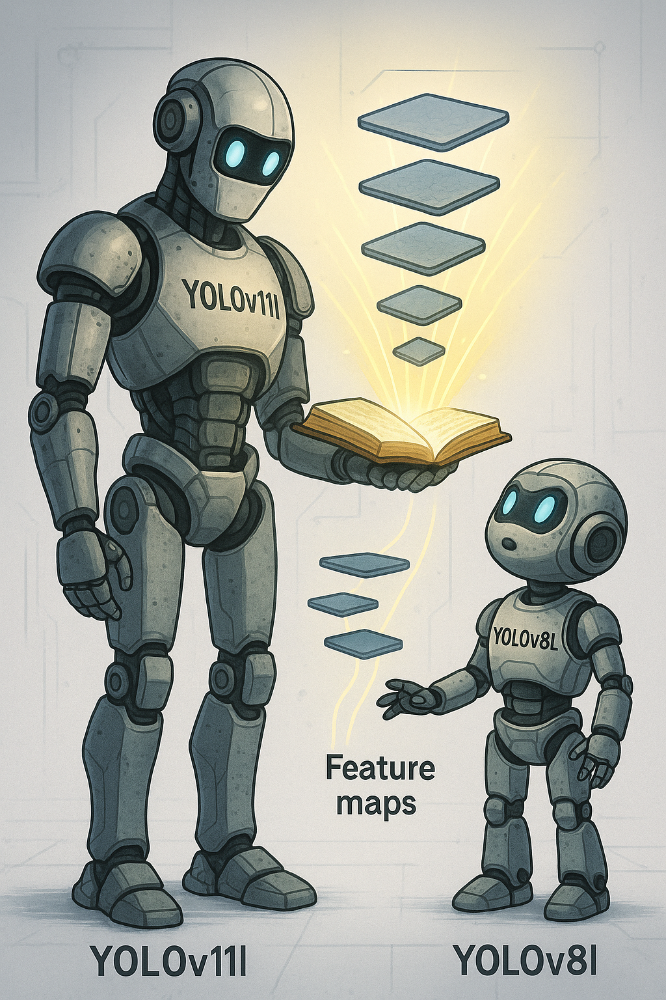

[TR]
# KNOWLEDGE DISTILLATION (YOLOv11l → YOLOv8l)

## Katman Eşleşmeli Knowledge Distillation ve Gerçek Zamanlı YOLO Modeli Oluşturulması

Bu projede, büyük ve güçlü bir öğretmen modeli olan **YOLOv11l**'nin bilgisini daha küçük ve hızlı bir öğrenci model olan **YOLOv8l**'ye aktarmayı amaçladık. Bu süreç, **Knowledge Distillation (KD)** adı verilen bir yöntemle yapay zekaların etkin kullanımıyla gerçekleştirilmiştir.

 

---

## Ara Katman Eşleşmeli Adaptör Eğitimi

Öğretmen ve öğrenci modelin iç yapıları birebir aynı olmadığı için, ikisi arasında birebir karşılaştırma yapmak zordur. Bu farkı ortadan kaldırmak için, **ara katman çıktılarının** eşleştirilebilmesi amacıyla **adapter (uyumlayıcı) katmanlar** eğitilmiştir.

- Öğretmen ve öğrenci modelin belli katmanları seçildi (`LAYER_PAIRS`) ve bu katmanlara **hook** bağlanarak ara çıktılar toplandı.
- Katmanlar arasında kanal ve boyut farkı varsa, `AdaptiveAvgPool2d` ve `Conv2d` kullanılarak **adaptör katmanları** tanımlandı.
- Öğrenci modelin tüm ağırlıkları donduruldu (`requires_grad = False`), sadece adaptörler eğitildi.
- Kayıp fonksiyonu olarak, ara katman çıktılarının MSE benzerliği (`feature_loss`) kullanıldı.
- Sonuçta, **sadece adaptörler** içeren `adapters_pretrained.pth` dosyası üretildi.

---

## Tüm Modelin Bilgi Damıtımı (Full KD Training)

Adaptörler ile öğrenci-öğretmen ara katmanları uyumlu hale geldikten sonra, artık öğrenci modelin kendisini eğiterek bilgi aktarımını tam olarak gerçekleştirmek.

- Bu aşamada artık **öğrenci modelin tüm parametreleri** ve adaptörler birlikte optimize edildi.
- Üç farklı kayıp fonksiyonu birlikte kullanıldı:
    1. `feature_loss`: Ara katman benzerliği (MSE)
    2. `soft_target_loss`: Öğretmenin yumuşatılmış çıktılarına göre KL Divergence
    3. `detect_output_loss`: Tespit başlığının (detection head) çıktılarındaki MSE
- Bu üç kayıp belirli ağırlıklarla (`FEATURE_W`, `SOFT_W`, `DETECT_W`) harmanlandı.
- Her epoch sonunda doğrulama (validation) kaybı hesaplandı ve en düşük kaybı veren model `final_distilled_model_with_detect.pth` olarak kaydedildi.

---

## Adaptörlerin Öğrenci Modele Gömülmesi

Elde edilen adaptörleri `nn.Sequential` yapısı ile öğrenci modelin ilgili katmanlarına **gömerek**, dışarıdan adaptör yüklenmesine ihtiyaç olmadan tek parça bir model elde etmek.

- Öğrenci modeli yeniden `DetectionModel` ile yüklendi.
- Adaptörler, belirlenen katmanlara `Sequential(original_layer, adapter)` şeklinde entegre edildi.
- Ortaya çıkan model `final_merged_model.pt` adıyla kaydedildi.

---

## YOLO API ile Uyumlulaştırma

Ultralytics’in `YOLO(...)` sınıfı ile doğrudan çalışabilecek bir `.pt` modeli üretmek.

- `final_merged_model.pt` modeli, `torch.save({'model': model})` şeklinde `YOLO` yapısına uyumlu hale getirildi.
- `final_ready_for_yolo2.pt` olarak kaydedildi.
- Bu model, artık Ultralytics’in `.predict()` fonksiyonu ile kullanılabilir hale geldi.

---

## Gerçek Zamanlı Kamera Üzerinden Test

Distil edilmiş modelin, canlı kamera görüntüsü üzerinde çalışıp çalışmadığını test etmek.

- Bilgisayar kamerası (`cv2.VideoCapture(0)`) açıldı.
- Her karede YOLO modeline tahmin yaptırıldı.
- Bounding box’lar ve sınıf isimleri görüntüye çizildi.
- FPS değeri her karede hesaplandı ve ekranda gösterildi.
- Sonuç olarak, distil edilmiş öğrenci modelin gerçek zamanlı çalışabildiği gösterildi.

---

## Parametre Farkı Analizi

Özgün öğrenci modeli (`yolov8l.pt`) ile bilgi damıtılmış öğrenci modeli (`final_ready_for_yolo.pt`) arasındaki parametre farkını ölçmek.

- Her iki modelin ağırlıkları `torch.load()` ile yüklendi.
- Float olan parametreler için ortalama mutlak fark (`mean(abs)`) hesaplandı.
- Böylece modelin ne kadar değiştiği sayısal olarak ölçüldü.

---

## Sonuç

Bu projede;

- Büyük ve güçlü bir YOLOv11l modeli, daha küçük ve hızlı bir YOLOv8l modeline **bilgi distilasyonu ile başarıyla aktarılmıştır**.
- Ara katman uyumu için özel **adaptör yapısı geliştirilmiş** ve katman eşleştirme yapılmıştır.
- Çok bileşenli bir loss fonksiyonu ile distilasyon süreci uygulanmış ve sonuçlar **gerçek zamanlı olarak doğrulanmıştır**.
- Elde edilen model, Ultralytics’in API’si ile tam uyumlu olacak şekilde optimize edilmiştir.

---

[EN]

# KNOWLEDGE DISTILLATION (YOLOv11l → YOLOv8l)

## Layer-Wise Knowledge Distillation and Real-Time YOLO Model Deployment

In this project, the objective was to transfer the knowledge of a large and powerful **YOLOv11l** teacher model to a smaller and faster **YOLOv8l** student model using the **Knowledge Distillation (KD)** technique.

 

---

## Adapter Training via Intermediate Feature Alignment

Since the internal architectures of the teacher and student models are not identical, direct comparison is not trivial. To bridge this gap, **adapter modules** were trained to align the **intermediate feature maps** between both models.

- Specific intermediate layers were selected (`LAYER_PAIRS`) and hooked to capture their outputs.
- If there were spatial or channel mismatches, `AdaptiveAvgPool2d` and `Conv2d` layers were used to define adapter modules.
- All student model parameters were frozen (`requires_grad = False`), and only the adapters were trained.
- MSE loss (`feature_loss`) was used to align intermediate features.
- Result: a checkpoint containing only adapters was saved as `adapters_pretrained.pth`.

---

## Full Knowledge Distillation Training

Once intermediate feature alignment was achieved using adapters, the full student model was trained to learn from the teacher's behavior.

- This time, **all student parameters** and adapters were optimized together.
- Three loss components were used simultaneously:
    1. `feature_loss`: Intermediate feature similarity (MSE)
    2. `soft_target_loss`: KL Divergence between softened outputs
    3. `detect_output_loss`: Output-level MSE between detection heads
- The total loss was computed as a weighted sum of the three (`FEATURE_W`, `SOFT_W`, `DETECT_W`).
- After each epoch, the validation loss was evaluated and the best-performing model was saved as `final_distilled_model_with_detect.pth`.

---

## Merging Adapters into the Student Model

The trained adapters were merged directly into the corresponding student layers using `nn.Sequential`, enabling a unified model without requiring external adapter loading.

- The student model was reloaded using `DetectionModel`.
- Adapter layers were inserted as `Sequential(original_layer, adapter)` at designated positions.
- Final merged model was saved as `final_merged_model.pt`.

---

## Exporting to YOLO-Compatible Format

To make the distilled model compatible with Ultralytics’ `YOLO(...)` class:

- The merged model was saved using `torch.save({'model': model})` format.
- Resulting file: `final_ready_for_yolo2.pt`
- This model can now be used with `YOLO().predict()` directly.

---

## Real-Time Webcam Testing

To verify the real-time usability of the distilled model:

- The system webcam was opened using `cv2.VideoCapture(0)`.
- Each video frame was passed to the YOLO model for prediction.
- Bounding boxes and class labels were drawn on-screen.
- FPS was calculated and displayed.
- Result: The distilled YOLOv8l model demonstrated **stable real-time performance**.

---

## Parameter Difference Analysis

To quantify the difference between the original and the distilled student models:

- Both model weights (`yolov8l.pt` and `final_ready_for_yolo.pt`) were loaded.
- Only floating-point parameters were compared using average absolute difference.
- This helped measure how much the distillation process modified the student model numerically.

---

## Conclusion

In this project:

- A large YOLOv11l model was successfully distilled into a smaller YOLOv8l model.
- A custom adapter architecture was developed to align intermediate features.
- Multi-component loss functions were applied for effective and precise distillation.
- The final student model is fully compatible with Ultralytics YOLO API and ready for real-time deployment.
---